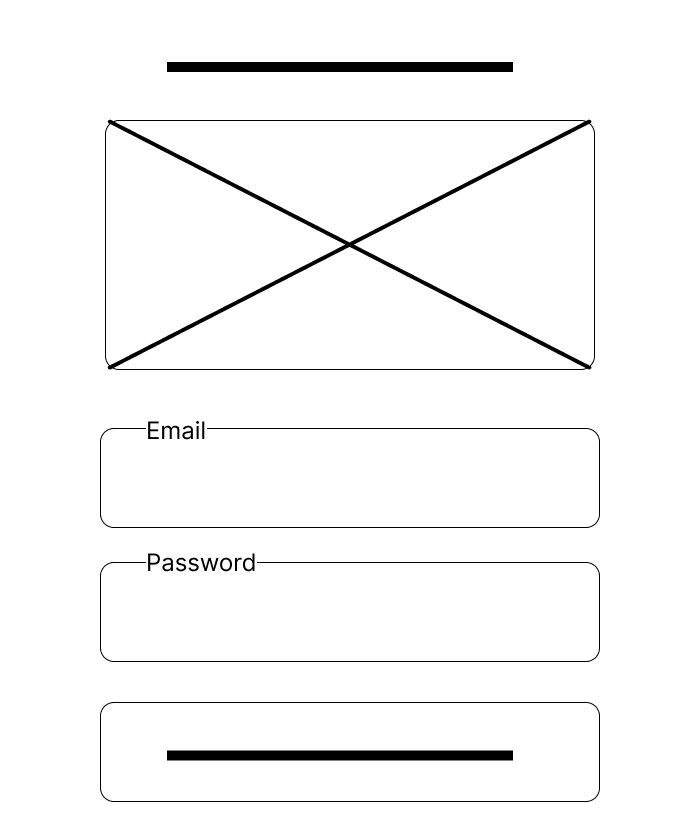

## Table of Contents
- [What is Wireframing?](#what-is-wireframing)
- [Why is Wireframing Important?](#why-is-wireframing-important)
- [Low-Fidelity vs High-Fidelity Wireframes](#low-fidelity-vs-high-fidelity-wireframes)
- [Key Elements of Wireframing](#key-elements-of-wireframing)
- [Types of Wireframes](#types-of-wireframes)
- [Wireframing Tools](#wireframing-tools)
- [Benefits of Wireframing](#benefits-of-wireframing-in-software-development)
- [Wireframing in Practice](#wireframing-in-practice)

# Introduction to Wireframing

## What is Wireframing?

Wireframing is a key step in the user interface (UI) and user experience (UX) design process. It involves creating simplified visual representations or "blueprints" of a digital product’s layout and structure before the actual design and development begin.

## Why is Wireframing Important?

Wireframes help designers and developers:
- Visualize the structure and flow of an interface early in the design process.
- Identify usability issues before investing time in detailed designs or coding.
- Communicate ideas clearly across teams and stakeholders.
- Save time and resources by iterating quickly on basic layout ideas.

## Low-Fidelity vs High-Fidelity Wireframes

- **Low-Fidelity**: Simple, sketch like mockups focusing on structure and layout.
- **High-Fidelity**: Detailed, interactive versions that closely resemble the final product.

Wireframing serves as the foundation for effective and user-friendly product design, helping teams stay aligned and reduce development risks

## Key Elements of Wireframing

A good wireframe includes essential elements that define how users will interact with a digital product. These elements help designers communicate the layout, usability, and functionality of the interface before visual design begins.

### 1. Layout Structure

**Definition**: The skeletal arrangement of the interface components on the screen.

**Example**: Defining a grid system where the header is at the top, a sidebar on the left, main content in the center, and footer at the bottom.  
**Contribution**: Ensures consistency across pages and helps users predict where to find information.

### 2. Navigation

**Definition**: The way users move between different sections or pages of the product.

**Example**: A top navigation bar with links to Home, About, Services, and Contact pages.  
**Contribution**: Helps users easily explore and interact with the product, improving usability and user satisfaction.

### 3. Content Placement

**Definition**: The strategic positioning of text, images, buttons, and other components on the page.

**Example**: Placing a "Sign Up" call-to-action prominently above the fold.  
**Contribution**: Prioritizes important information and guides users toward desired actions.

### 4. Functionality

**Definition**: The intended behaviors and actions that interactive components will support.

**Example**: A clickable button that opens a modal form, or a search bar that filters results in real time.  
**Contribution**: Defines user interactions early and helps plan for development needs and technical constraints.

## Types of Wireframes

Wireframes come in different levels of fidelity depending on their purpose in the design process. The two main types are:

### Low-Fidelity Wireframes

**Definition**: These are basic sketches or rough layouts used to represent the structure of a design. They are usually grayscale and focus more on layout than visuals or interactivity.

**Characteristics**:
- Simple, block-style design
- No colors, images, or real content
- Placeholder text and icons
- Focused on layout and content hierarchy

**When to Use**:
- In the early stages of the design process
- For brainstorming and quick iterations
- To gather early feedback from stakeholders

### High-Fidelity Wireframes

**Definition**: These are detailed representations that closely resemble the final product in terms of layout, design, and functionality. They may include real images, typography, and interactive elements.

**Characteristics**:
- Full visual detail (colors, fonts, branding)
- Interactive components like dropdowns or buttons
- Real or near-real content

**When to Use**:
- In later stages of the design process
- For usability testing and developer handoff
- To demonstrate final concepts to stakeholders

## Example Analysis: What Type of Wireframe is This?

This example represents a **Low-Fidelity Wireframe** because:
- It uses simple shapes and outlines
- There is no color, branding, or detailed content
- It focuses on layout and page structure rather than appearance or interaction

If your wireframe is more detailed and includes UI elements like butt

## Wireframing Tools

There are several tools available to help designers create wireframes efficiently, ranging from basic drawing applications to advanced collaborative platforms. Choosing the right tool depends on the project stage, team needs, and level of fidelity required.

### Popular Wireframing Tools

- **Figma**: A browser-based design and prototyping tool with powerful real-time collaboration features.
- **Balsamiq**: Ideal for low-fidelity wireframes; provides a sketch-like look and feel.
- **Adobe XD**: Offers wireframing, UI design, and prototyping in one application.
- **Sketch**: A vector-based design tool popular for high-fidelity UI design and wireframing (Mac-only).
- **Whimsical**: Great for fast, collaborative low-fidelity wireframes and user flows.

### Why Use Figma?

Figma stands out as one of the most widely used tools in the industry for both beginners and professionals. Here's why:

- **Web-Based & Cross-Platform**: No need to install software. It runs directly in the browser and supports Windows, macOS, and Linux.
- **Real-Time Collaboration**: Multiple team members can work on the same design file simultaneously, similar to Google Docs.
- **Intuitive Interface**: Easy to learn and use, even for those new to design.
- **Version History**: Tracks all changes made to files, allowing you to revert or compare versions.
- **Component System**: Enables reuse of design elements (buttons, cards, layouts) to maintain consistency.
- **Prototyping**: Allows you to link frames and create interactive flows without leaving the design tool.
- **Community Resources**: Offers thousands of free templates, icons, and UI kits.

Figma’s balance of simplicity, power, and collaboration makes it an excellent choice for creating both low-fidelity and high-fidelity wireframes.

## Benefits of Wireframing in Software Development

Wireframing plays a crucial role in software development by serving as a visual guide for both design and implementation. It helps align the vision between stakeholders, designers, and developers before any code is written.

### 1. Improves Communication

Wireframes make abstract ideas concrete, allowing everyone involved to see and discuss the structure and flow of the product early on.

**Example**: A project manager can use a wireframe to confirm with the client how the layout of a dashboard will look before development begins, reducing miscommunication.

### 2. Saves Time and Resources

Catching design issues at the wireframe stage is faster and cheaper than during development. Adjustments made to a wireframe take minutes. compared to hours or days when made in code.

**Example**: By identifying that users need quicker access to search features during the wireframe review, a team can avoid reworking an entire navigation component after development has started.

### 3. Enhances User-Centered Design

Wireframes prioritize user needs by focusing on layout, navigation, and content hierarchy before visual elements are added.

**Example**: A UX designer might notice that a "Sign Up" button is buried at the bottom of a wireframe, and suggest moving it above the fold to improve conversions. before any design is finalized.

### 4. Bridges the Gap Between Design and Development

Wireframes provide developers with a clear blueprint of expected functionality and layout, reducing ambiguity.

**Example**: A developer can begin structuring the HTML layout or database relationships based on the wireframe, even before the final UI design is delivered.

### 5. Reduces Project Risk

Wireframing helps identify usability issues and feature gaps early in the process, which prevents costly revisions later.

**Example**: During wireframe reviews, a team might realize that the user flow for resetting a password is unclear. this can be corrected before building backend logic.

---

Wireframes are not just a design tool. they're a strategic asset in the software development process, supporting better decision-making, smoother collaboration, and higher-quality outcomes.

## Wireframing in Practice

### Real-World Scenario

A startup was developing a mobile app that allowed users to schedule and manage appointments with local service providers. Before any development began, the UX team created wireframes to map out the user journey from account creation to booking a service.

### Identified Usability Issues

During wireframe reviews, the team noticed the following problems:

- **Confusing Navigation**: Users had to go through multiple screens to access the booking page.
- **Hidden Primary Action**: The “Book Now” button was placed at the bottom of a long scrollable list, making it difficult to find.
- **Redundant Input Fields**: Users were asked to re-enter information already stored in their profiles.

These issues were identified quickly during the wireframing phase, thanks to internal usability testing with non-technical stakeholders.

### Resolution

- The navigation flow was simplified to reduce the steps from five to three.
- The “Book Now” button was moved to the top of the screen and styled prominently.
- Input fields were auto-filled using existing user profile data.

### Impact on Final Product

Because these issues were addressed early, the development team was able to implement a more intuitive and efficient user experience from the start. User testing post-launch showed a **30% increase in successful bookings** and a **significant drop in support tickets** related to navigation confusion.

### Conclusion

This scenario highlights how wireframing plays a critical role in uncovering and resolving usability issues before code is written. By visualizing and testing the user flow early, teams can save time, avoid costly redesigns, and deliver products that are user-friendly from day one. Wireframing ensures that the design is not only functional but also aligns with user expectations and business goals.

